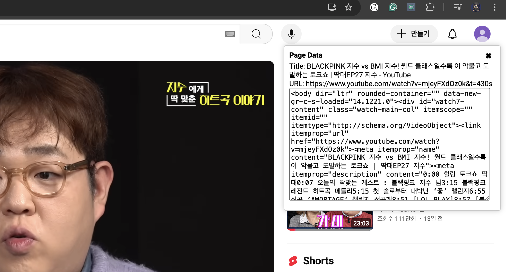
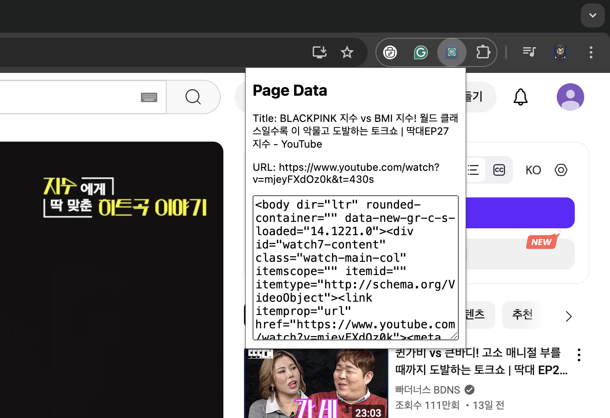
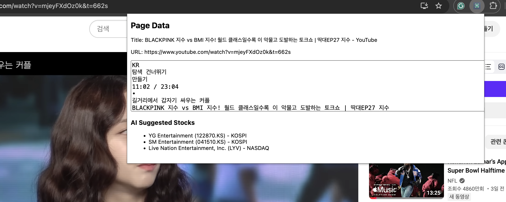

# SAE-Chrome-Dev

## Goal & Purpose

- KOR: '온 세상이 주식이야'(이하 온세주)의 크롬 익스텐션 개발을 위한 개발 저장소
- ENG: Chrome Extension Dev repository for 'Stocks Are Everywhere'

## Directory Structure

```bash
SAE-Chrome-Dev/
├── tutorial-data
├── tutorial-hello
├── tutorial-typescript
└── ai-chrome-extension
```

## [tutorial-hello](https://github.com/jwywoo/SAE-Chrome-Dev/tree/main/tutorial-hello)

Basic Chrome Extension Tutorial

## [tutorial-typescript](https://github.com/jwywoo/SAE-Chrome-Dev/tree/main/tutorial-typescript)

Basic Chrome Extension with TypeScript Tutorial

## [tutorial-data](https://github.com/jwywoo/SAE-Chrome-Dev/tree/main/tutorial-data)

Basic Chrome Extension with data collection feature

- Title
- URL
- HTML

### Result: Chrome Extension with Data Collection Feature

| Data Collection Done | Popup: Data read from floating popup | Popup: Data read from extension popup |
| ----- | ----- | ----- |
|  |  |  |

## [ai-chrome-extension](https://github.com/jwywoo/SAE-Chrome-Dev/tree/main/ai-stock-extension)

### AS IS

- Sending a request and displaying the result from AI API Server

### TO BE

- Available for market
- Fetching: Spring Server
- Authentication
- Websocket: Realtime connection with FastAPI

### Result: AI Chrome Extension

- Youtube: [BLACKPINK 지수 vs BMI 지수! 월드 클래스일수록 이 악물고 도발하는 토크쇼 | 딱대EP27 지수](https://www.youtube.com/watch?v=mjeyFXdOz0k)


